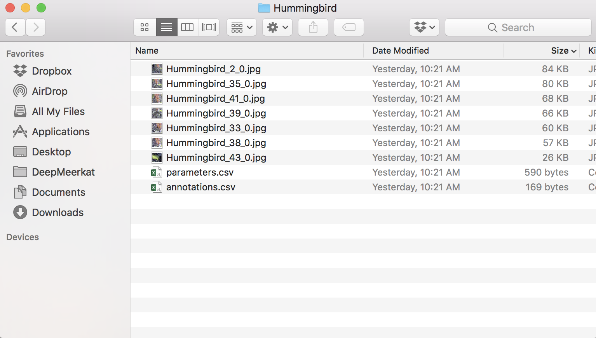
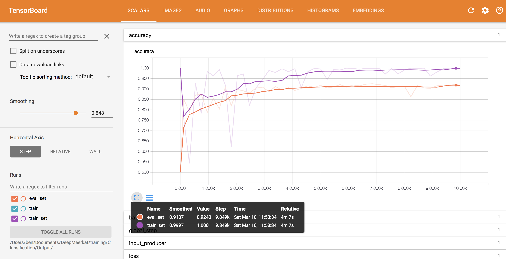

# Appendix 1: Training DeepMeerkat models outside of Google Cloud
Ben Weinstein  
3/8/2018  

While it is recommended to use the provided scripts for Google Cloud Platform to train new models, some users will have access to local high performance clusters, and will want additional technical information on building models that can be used in DeepMeerkat. Here I provide an overview of training new models on local machines. While it is not possible to anticipate the varied environments, dependencies and job submission frameworks that users might encounter, there are broad guidelines that will help development. For the purposes of the supplement, it is assumed that the user wants to build a local tensorflow model. This appendix assumes a reasonable background in git and python to achieve local training.

# Overview of Model Specification

DeepMeerkat uses tensorflow models to predict new bounding boxes. DeepMeerkat expects the following characteristics:

  * Tensorflow models are saved in the SavedModel format. Such that they can be loaded by the tf.saved_model.loader.load class. 
  
  * Models have two classes. The first class is “Positive”, defined as crops that contain objects of interest. The second class is “Negative”, defined as crops that contain objects to be ignored. To use ensure consistency, always encode the "Positive" class as the first class and "Negative" class as the second class. 
  
  * Models take in numpy arrays. Numpy is the most common matrix library in python and fundamental to many scientific applications. The predict function of DeepMeerkat begins.
  

```r
for x in image_array:
    bimage=cv2.imencode(".jpg", x)[1].tostring()
    tfimages.append(bimage)
```

This means that the input list of bounding boxes is passed to the model as the object named 'image_array'. Each image is read by opencv and encoded into a byte string. So long as your images are saved as a .jpg and can be read by OpenCV, they will be automatically converted, no other alteration is needed.

# Generating images

DeepMeerkat works on image clips, not on the entire image. The simplest way to generate clips is to use the training mode under advanced settings.

For each video, training mode will export clips to be scored.




The filename is the video name, the frame number, and the index of the bounding box. For each image, determine whether the content is background ("Negative") or an object of interest ("Positive"). Create two sets of folders, one for training, one for testing. Each should have a Positive and Negative folder. While there is no rule, a ratio of 5:1 training to testing data is a good guideline. While "Negative" frames may be easier to come by, try to balance positive and negative frames from each video. The training scripts will enforce an equal proportion among classes, so there is no need to put a huge number of negative frames in the folders if there are relatively few positive frames. A few sample images are included in the git repo under "Samples/".

# Local Training

For ease of reproducibility, follow this git repo, using the "local" branch.


```r
git clone -b local https://github.com/bw4sz/DeepMeerkat.git
```

## Optional: Create a virtual environment

It is highly recommended to have a clean python environment. This appendix was tested on OSX High Sierra 10.12.6.

```{}
virtualenv env
source env/bin/activate
```

Install the required python packages

```{}
pip install -r requirements.txt
```

We also need the google cloud SDK, just to mimic the cloud environment, no google services are being used.

```{}
curl https://sdk.cloud.google.com | bash
```

## Navigate to the Classifiction training directory


```r
cd training/Classification
```

**CreateDocs.py** is a wrapper script to make a .csv file with the path to each image and whether it is "Positive" or "Negative" label.

**env** is the virtual python environment 

**Training.sh** Main entry point

**Samples** The directory for positive and negative training/testing images. Just a tiny fraction are included in this repo for demo purposes. *Replace* these images with your desired .jpgs.

## Generate the csv files needed for model training


```r
python CreateDocs.py
```

This created a testingdata.csv file in the Testing folder, and a trainingdata.csv file in Training folder. It also created the dict.txt file which just tells us that the first class is named "positive" and the second "negative". For consistancy, use lower case.

## Run Pipeline

We can mimic the google cloud environment on our local machine and execute the same pipeline.py. 


```r
python pipeline.py
    --train_input_path /Users/ben/Documents/DeepMeerkat/training/Classification/Samples/Training/trainingdata.csv
    --eval_input_path /Users/ben/Documents/DeepMeerkat/training/Classification/Samples/Testing/testingdata.csv
    --input_dict /Users/ben/Documents/DeepMeerkat/training/Classification/Samples/dict.txt
    --output_dir /Users/ben/Documents/DeepMeerkat/training/Classification/Output/
```

The paths must be changed to the local of your local git repo. For clarity, I recommend using absolute paths.

In sum, the steps are captured in the provided file Training.sh

Training.sh

```{}
#!/bin/bash 

#start virtual env
#virtualenv env
source env/bin/activate

#make sure all requirements are upgraded
pip install -r requirements.txt

############
#Train Model
############

#Create Docs
python CreateDocs.py

python pipeline.py
    --train_input_path /Users/ben/Documents/DeepMeerkat/training/Classification/Samples/Training/trainingdata.csv
    --eval_input_path /Users/ben/Documents/DeepMeerkat/training/Classification/Samples/Testing/testingdata.csv
    --input_dict /Users/ben/Documents/DeepMeerkat/training/Classification/Samples/dict.txt
    --output_dir /Users/ben/Documents/DeepMeerkat/training/Classification/Output/
```

Annotated output (condensed for viewing) will look like this:

```{}
(env) MacBook-Pro:Classification ben$ bash Training.sh 

#Install Packages
Requirement already satisfied: apache-beam[gcp]==0.6.0 in ./env/lib/python2.7/site-packages (from -r requirements.txt (line 1))
Requirement already satisfied: pillow==4.0.0 in ./env/lib/python2.7/site-packages (from -r requirements.txt (line 2))
...

#Generate documents
Positive training samples: 5000
Negative training Samples: 5000
Positive testing samples: 500
Negative testing Samples: 500

#Bundle package for training
running sdist
running egg_info
writing requirements to trainer.egg-info/requires.txt
writing trainer.egg-info/PKG-INFO
...

#Start tensorflow
W tensorflow/core/platform/cpu_feature_guard.cc:45] The TensorFlow library wasn't compiled to use SSE4.1 instructions, but these are available on your machine and could speed up CPU computations.
...

#Preprocess images
INFO:root:Original job data: {u'args': [u'--output_path', u'/Users/ben/Documents/DeepMeerkat/training/Classification/Output/', u'--eval_data_paths', u'/Users/ben/Documents/DeepMeerkat/training/Classification/Output/preprocessed/eval*', u'--eval_set_size', u'1000', u'--train_data_paths', u'/Users/ben/Documents/DeepMeerkat/training/Classification/Output/preprocessed/train*'], u'job_name': u'trainer.task'}
...

#Train Model
#The first value is the loss, the second is the accuracy.
INFO:root:Train [master/0], step 1 (0.084 sec) 11.9 global steps/s, 11.9 local steps/s
INFO:root:Eval, step 1:
- on train set 0.029, 1.000
-- on eval set 1.799, 0.500
INFO:root:Train [master/0], step 118 (4.041 sec) 29.6 global steps/s, 29.6 local steps/s
INFO:root:Eval, step 118:
- on train set 0.463, 0.763
-- on eval set 0.359, 0.852
INFO:root:Adjusting eval interval from 2.00s to 3.51s
INFO:root:Train [master/0], step 237 (7.807 sec) 31.6 global steps/s, 31.6 local steps/s
INFO:root:Train [master/0], step 327 (9.313 sec) 59.8 global steps/s, 59.8 local steps/s
...
INFO:tensorflow:SavedModel written to: /Users/ben/Documents/DeepMeerkat/training/Classification/Output/model/saved_model.pb
INFO:tensorflow:SavedModel written to: /Users/ben/Documents/DeepMeerkat/training/Classification/Output/model/saved_model.pb
```

Depending on the number of training images, the total run time may be several hours. This appendix was tested on a MacBook Pro with a 3.1 GHz Intel Core i5 processor and 16GB of memory. Training on 5,000 training images and 500 testing images for both positive and negative classes was completed in about 2 hours.

### Viewing results

Tensorflow comes with a data viewer called tensorboard that will help us interpret model results. Specify a port to view in the local browser.

```{}
tensorboard --logdir=/Users/ben/Documents/DeepMeerkat/training/Classification/Output/ --port=8008
```



Opening the browser to the specified port (localhost:8008), we can see a nice set of accuracy and loss graphs. Our test dataset reached a 92% accuracy on the training data. The model/ directory contains our saved model. This directory is then specified in advanced settings in the DeepMeerkat GUI.

### Speeding up model training

The great advantage of using google cloud is that leverages Google Cloud Dataflow for parallel processing of the frozen input images. Since these layers are the same every time a model is trained, we can preprocess them on many machines and save them in the TFRecords format. When we leave google cloud environment, we are on our own for parallel tasks. If a user is interested in preprocessing images in parallel using local resources, there are few considerations.

The preprocessing script is trainer/preprocess.py. It takes in the path to a csv file (i.e the testingdata.csv or trainingdata.csv files above), a dictionary file specifying the labels (i.e the dict.txt file above), and an output location. One approach would be to distribute a different csv file to each worker, such that multiple workers were executing preprocess.py, but on different parts of the training data. 

```{}
python trainer/preprocess.py --input_path /Users/ben/Documents/DeepMeerkat/training/Classification/Samples/Training/trainingdata.csv --input_dict /Users/ben/Documents/DeepMeerkat/training/Classification/Samples/dict.txt --output_path Output
```

This will create the TFrecords file that is read by tensorflow during model training. Once all the TFRecords files are processed, we can tell the pipeline to skip the preprocessing step and go directly to model training.

```{}
python pipeline.py
    --preprocessed_train_set /Users/ben/Documents/DeepMeerkat/training/Classification/Output/train
    --preprocessed_eval_set /Users/ben/Documents/DeepMeerkat/training/Classification/Output/eval
    --input_dict /Users/ben/Documents/DeepMeerkat/training/Classification/Samples/dict.txt 
    --output_dir /Users/ben/Documents/DeepMeerkat/training/Classification/Output/
```


